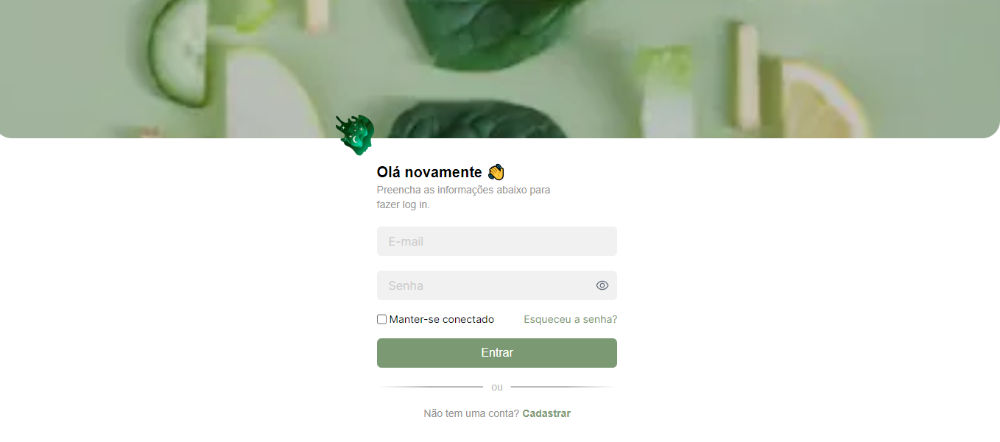

# Academia Sesi

> Soulheal - Seja maior do que a sua melhor desculpa

[🔗 Clique aqui para acessar o site](https://soulheal-ten.vercel.app/)

# 🛠️ Documentação do site

## Visão Geral

O SoulHeal é um site voltado para a promoção de hábitos saudáveis, abrangendo diferentes aspectos da saúde, como hidratação, alimentação, exercícios físicos e práticas mentais. O aplicativo foi desenvolvido com o objetivo de oferecer aos usuários uma plataforma completa para melhorar seu bem-estar geral (físico e mental), personalizando as atividades de acordo com as necessidades e vontades individuais.

## Funcionalidades Principais

1. Registro e Perfil do Usuário
- Cadastro de Perfil: Os usuários devem criar um perfil com algumas informações, como email, nome completo e uma senha.
- Informações: O aplicativo pode solicitar informações adicionais, como peso, altura, idade, tipo de alimentação, frequência de atividades e objetivos de saúde.
  
2. Monitoramento de Consumo de Água
- Cálculo Personalizado: Com base nas informações do perfil do usuário, o aplicativo calcula a quantidade ideal de ingestão de água por dia.

3. Planejamento de Alimentação
- Recomendações Personalizadas: O SoulHeal fornece planos de refeições personalizados com base nos objetivos de saúde e preferências alimentares do usuário.
  
4. Programas de Treino Personalizados
- Treinos Adaptáveis: Com base nos objetivos de condicionamento físico do usuário, são propostos programas de exercícios físicos personalizados.
- Acompanhamento de Progresso: Os usuários podem monitorar seu progresso.

5. Práticas Mentais e Bem-Estar
- Meditação e Respiração: O aplicativo oferece sessões guiadas de meditação e exercícios de respiração para promover o relaxamento e o equilíbrio mental.

## Tecnologias Utilizadas
- Frontend: Next.js para a interface do usuário responsiva e amigável.
- Banco de Dados: Utilização do firebase para armazenar informações de perfil.
- Armazenamento de dados: Local Storage para armazenar e persistir dados localmente no computador do usuário. 
- Integrações de API: Integrações com APIs de nutrição para fornecer dados precisos e atualizados.
- Controle de Versão: GitHub para o controle de versão do código-fonte e colaboração entre desenvolvedores.

## Segurança e Privacidade
- Controle de Acesso: Cada página verifica se o usuário está devidamente autenticado (logado) antes de permitir o acesso, garantindo que apenas usuários autorizados possam visualizar as funcionalidades do aplicativo.
- Proteção de Dados: Os dados dos usuários são armazenados de forma segura, com acesso restrito e criptografado para preservar a privacidade e confidencialidade das informações pessoais.

## Futuras Atualizações e Melhorias
- Integração de Dispositivos Wearables: Possibilidade de sincronização com dispositivos como smartwatches para um acompanhamento mais preciso.
- Personalização Avançada: Melhorias na personalização dos planos de saúde com base em dados em tempo real e feedback dos usuários.
- Lembretes e Notificações: Os usuários recebem lembretes ao longo do dia para garantir a hidratação adequada.
- Lista de Compras: Os usuários podem gerar listas de compras com base nos planos de refeições propostos.
- Dicas de Saúde Mental: Conteúdos informativos e dicas para melhorar o bem-estar psicológico são disponibilizados regularmente.

> O SoulHeal foi desenvolvido com o intuito de oferecer uma abordagem holística para a saúde e o bem-estar, fornecendo aos usuários uma ferramenta abrangente para melhorar seus hábitos e qualidade de vida.
Esta documentação está sujeita a atualizações conforme novas funcionalidades e melhorias são implementadas no aplicativo SoulHeal.

---------------------

## 👥 Alunos

- Nicole Licyane
- Gustavo Braga
- Pedro Henrique

## ✉️ Contato

nicole_lv_silva@estudante.sesisenai.org.br 
gustavo_s_braga@estudante.sesisenai.org.br 
pedro_hc_nunes@estudante.sesisenai.org.br 
